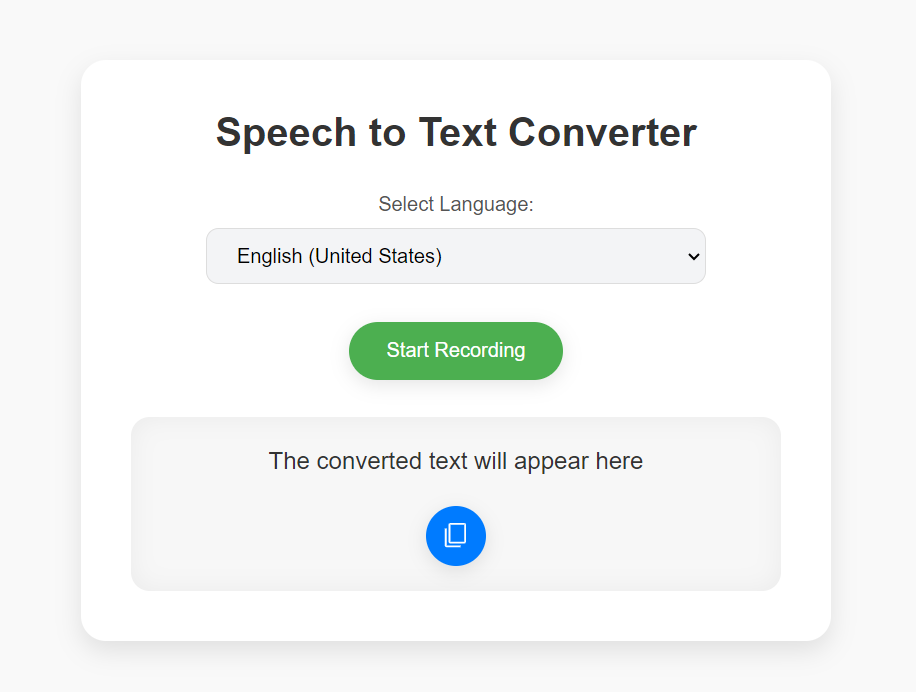
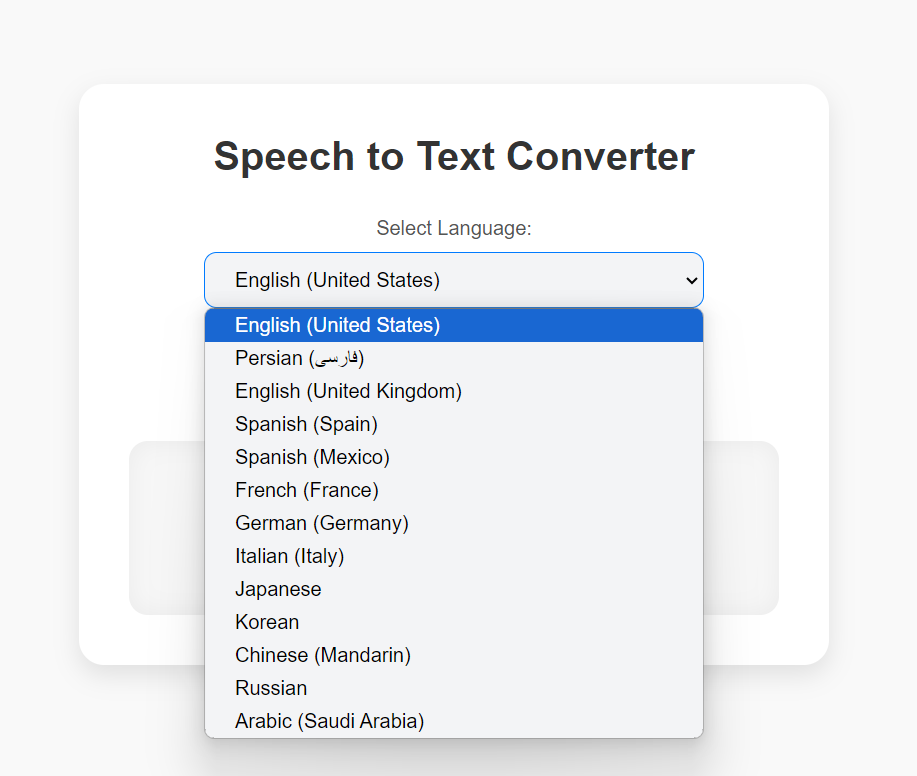

# Speech to Text Converter

This project is a modern **Speech to Text** application built using **JavaScript**, **HTML**, and **CSS**. It allows users to convert their speech into text, supports multiple languages, and provides options to copy the converted text easily.

## Table of Contents
- [Screenshot](#screenshot)
- [Features](#features)
- [Built With](#built-with)
- [Prerequisites](#prerequisites)
- [Usage](#usage)
- [Contact](#contact)

## Screenshot






<p align="right">(<a href="#table-of-contents">back to top</a>)</p>

## Features

- Modern and user-friendly interface with responsive design.
- Supports multiple languages for speech recognition.
- Simple start/stop recording button.
- Displays converted text in real-time.
- Ability to copy the converted text using a stylish copy button with an **SVG** icon.
- Interactive feedback for errors (like browser compatibility issues).

<p align="right">(<a href="#table-of-contents">back to top</a>)</p>

## Built With

This project was built using the following technologies:

* 
* 
* 

<p align="right">(<a href="#table-of-contents">back to top</a>)</p>

## Prerequisites

To run this project, you will need a modern web browser that supports the Web Speech API for speech recognition, such as Google Chrome or Microsoft Edge. No additional libraries or dependencies are required.

<p align="right">(<a href="#table-of-contents">back to top</a>)</p>

## Usage

1. Clone the project from GitHub or download the files:
   ```bash
   git clone https://github.com/AmirrezaAhmadi/SpeechToText-Converter.git

2. Open the SpeechToText.html file in your browser.

<p align="right">(<a href="#table-of-contents">back to top</a>)</p>

## Contact

You can reach me through the following:

* Email: AmirrezaAhmadi.GH@Gmail.com
* Telegram: https://t.me/AmirrezaDevelop
* Instagram: https://www.instagram.com/codewithamirreza
* Project Link: https://github.com/AmirrezaAhmadi/SpeechToText-Converter.git

<p align="right">(<a href="#table-of-contents">back to top</a>)</p>